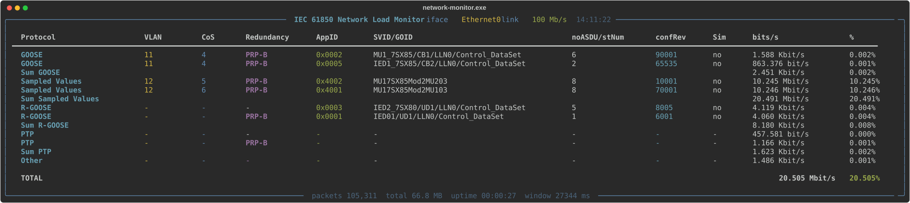
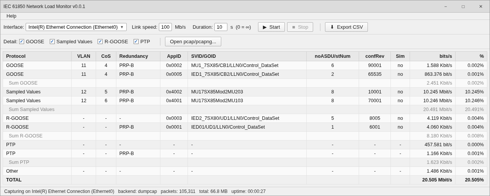

# IEC 61850 Network Load Monitor

Captures raw Ethernet frames on a network interface (or reads a `.pcap`/`.pcapng`
file) and classifies traffic by protocol, VLAN, and redundancy scheme
(HSR/PRP), reporting throughput and link-load percentage per protocol.

Version 0.0.2 — License: [GPL-2.0-only](LICENSE) (required by the `scapy`
dependency; see [THIRD_PARTY_LICENSES](#third-party-licenses) below).

Two front ends share the same capture/parsing engine (`monitor.py`):

- **`monitor.py`** — terminal UI (CLI), built on [rich](https://github.com/Textualize/rich).
- **`monitor_gui.py`** — desktop UI (GUI), built on Tkinter (Python standard library).

## Screenshots

**CLI** — real output, rendered directly from `monitor.py`'s own display code
against a real capture (`--pcap --goose --sv --rgoose --ptp` — this capture
carries no MMS/DNP3/IEC104/Modbus TCP traffic, so those detailed rows aren't
pictured; pass `--all` to break out every protocol a capture actually has):



**GUI** — a recreation matching the real widget layout exactly (interface
picker, link speed/duration, Start/Stop, the protocol-detail checkboxes,
Open pcap/pcapng, and the results table/status bar). This is not a live
capture — a real Windows desktop wasn't available to screenshot in the
environment this was built in — but every label, column and control matches
`monitor_gui.py`'s actual layout one-for-one:



## File integrity

SHA256 of each source file and its corresponding compiled Windows binary, so
you can confirm a copy hasn't been altered in transit. Recompute with
`sha256sum <file>` (Linux/macOS) or `CertUtil -hashfile <file> SHA256`
(Windows) and compare.

| File | Version | SHA256 |
|---|---|---|
| `monitor.py` | 0.0.2 | `8e8af8ed488698862a9e98d2329013fe818a66dc669a50ef4e3a22ad6f829cff` |
| `monitor_gui.py` | 0.0.2 | `69947c51ec1958d5f7a5820f4d04d4af4e08a09f35eef93c703340d525a5a2b5` |
| `network-monitor.exe` | 0.0.2 | `a1096432290a6dc6ddcbc07f562180e3a481afe4127dc905a95e08953c2c58a5` |
| `network-monitor-gui.exe` | 0.0.2 | `e1236b95946e649ba09ea248ce95e40f8e7c79958abe79eb8513b54a42da9052` |

> These hashes must be regenerated any time the corresponding file changes —
> they are not automatically kept in sync.

Protocols with their own detailed row (off by default — see below):

| Protocol | Identification |
|---|---|
| GOOSE | EtherType `0x88B8` |
| Sampled Values (SV) | EtherType `0x88BA` |
| R-GOOSE | UDP multicast (IEC 61850-8-2) |
| PTP / IEEE 1588 | EtherType `0x88F7` |
| MMS | TCP port `102` + TPKT header verification (unicast, IEC 61850-8-1) |
| DNP3 | TCP/UDP port `20000` + data-link sync-byte verification (unicast) |
| IEC104 | TCP port `2404` + APCI start-byte verification — IEC 60870-5-104 (unicast) |
| Modbus TCP | TCP port `502` + MBAP header verification (unicast) |

For these four, the well-known port is only a hint — a matching port with a
payload that doesn't parse as that protocol's actual framing (TPKT magic
bytes, DNP3 sync bytes, IEC104 APCI start byte, or Modbus MBAP header) is
left classified as "IPv4"/"Other" rather than assumed to be that protocol.

By default all eight are folded into a single "Other" line — pass
`--goose`/`--sv`/`--rgoose`/`--ptp`/`--mms`/`--dnp3`/`--iec104`/`--modbus`
(CLI) or tick the matching checkbox (GUI) to break any of them out into
their own detailed rows (VLAN, CoS, AppID, SVID/GOID, noASDU/stNum, confRev,
Sim — the AppID/SVID/GOID-style columns only ever populate for GOOSE/SV/
R-GOOSE; the unicast protocols show '-' there).

Everything else — R-SV, GSSE (legacy), NTP (UDP port 123), LLDP, RSTP, ARP,
IPv4, IPv6, and any unclassified traffic — is still recognized internally
but always aggregated into that "Other" row; there's no per-protocol
breakdown for it.

HSR / PRP redundancy (in-frame tag `0x892F` / RCT trailer `0x88FB`) is
detected and shown as its own column regardless of which protocol flags are set.

---

## Which version should I use?

| | Windows GUI | Windows CLI | Linux (python3) |
|---|---|---|---|
| Install needed | None (single `.exe`) | None (single `.exe`) | Python 3 + venv |
| Best for | Point-and-click use | Scripting / remote / headless boxes | Development, servers |
| File | `dist/network-monitor-gui.exe` | `dist/network-monitor.exe` | `monitor.py` / `monitor_gui.py` |

---

## 1. Windows — GUI (compiled binary)

No Python installation required — everything (Python, scapy, rich, Tk) is
bundled into a single executable.

1. Copy `network-monitor-gui.exe` to the Windows machine.
2. Double-click it (or run it from a terminal to see startup errors, if any).
3. Capturing live traffic needs a packet-capture driver:
   - Install [Wireshark](https://www.wireshark.org/) (it bundles **Npcap**,
     which the GUI's live-capture backends rely on either directly or via
     `dumpcap.exe`).
   - By default Npcap restricts raw capture to Administrators. Either:
     - run the `.exe` as Administrator, **or**
     - re-run the Npcap installer (Control Panel → Programs → Npcap →
       Change) and uncheck **"Restrict Npcap driver's access to
       Administrators only"** to capture without elevation.
4. In the window:
   - Pick a **network interface** from the dropdown.
   - Set **link speed** (Mb/s) and **duration** (`0` = run forever).
   - Click **▶ Start** / **■ Stop**.
   - Tick the **Detail** checkboxes (GOOSE / Sampled Values / R-GOOSE / PTP /
     MMS / DNP3 / IEC104 / Modbus TCP) to break any of them out of the
     "Other" row — this can be toggled at any time, even mid-capture.
   - **Open pcap/pcapng...** loads a capture file from disk instead of
     capturing live (a progress readout appears in the status bar while a
     large file loads — this can take tens of seconds for very large files).
   - **Export CSV** saves the current table.
   - **Help → About** shows the software name, version and license.

## 2. Windows — CLI (compiled binary)

Same engine as the GUI, no Python required, but runs in a console and is
scriptable.

```
network-monitor.exe [INTERFACE] [OPTIONS]
```

The same capture-driver requirements as the GUI apply (Wireshark/Npcap
installed, and either Administrator or the Npcap non-admin setting above).

List available interfaces first — on Windows this shows the NIC's friendly
description instead of its raw device path:

```
network-monitor.exe --list
```

Then capture on one of them:

```
network-monitor.exe "Ethernet0" -d 30 -s 1000
```

See [Command-line reference](#command-line-reference) below for every flag —
it's identical between the compiled `.exe` and running `monitor.py` directly.

## 3. GNU/Linux — running from source with python3

On Linux there's no compiled binary; run the scripts directly with Python 3.
**Use a virtual environment (`venv`)** so scapy/rich are installed in an
isolated directory instead of polluting (or fighting version conflicts with)
whatever Python packages the rest of the OS relies on:

```bash
# from the project directory
python3 -m venv venv
source venv/bin/activate          # ". venv/bin/activate" in POSIX sh
pip install -r requirements.txt   # installs scapy + rich into venv/, not system-wide
```

Every time you come back to work on/run this project in a new shell, re-activate it first:

```bash
source venv/bin/activate
```

(`deactivate` leaves the venv. You can also skip activation and call the
interpreter directly, e.g. `venv/bin/python3 monitor.py ...` — useful for
one-off commands or cron jobs.)

Run the CLI:

```bash
python3 monitor.py eth0 -d 30       # or: venv/bin/python3 monitor.py eth0 -d 30
```

Run the GUI (needs Tk; on Debian/Ubuntu install it with
`sudo apt install python3-tk` if `tkinter` isn't already present in your
Python install — this is a system package, not something `pip`/`venv` can
provide):

```bash
python3 monitor_gui.py
```

**Capture permissions on Linux** — one of:
- run with `sudo` (works everywhere, requires re-activating the venv or
  using its full path since `sudo` drops your shell's env by default:
  `sudo venv/bin/python3 monitor.py eth0`), **or**
- give the interpreter `CAP_NET_RAW`:
  `sudo setcap cap_net_raw+eip $(readlink -f venv/bin/python3)`, **or**
- install `wireshark-common` and add your user to the **`wireshark`** group
  (`sudo usermod -aG wireshark $USER`, then log out/in) — the app falls
  back to `dumpcap` automatically if it can't open a raw socket.

---

## Command-line reference

```
usage: monitor.py [-h] [-d SEC] [-s MBPS] [-r SEC] [-l] [-V] [--pcap FILE]
                   [--goose] [--sv] [--rgoose] [--ptp]
                   [--mms] [--dnp3] [--iec104] [--modbus] [--all]
                   [interface]

positional arguments:
  interface           Network interface to capture on (default: eth0)

options:
  -h, --help          show this help message and exit
  -d, --duration SEC  Stop after this many seconds; 0 = run forever (default: 10)
  -s, --speed MBPS    Link speed in Mb/s used for load % calculation (default: 100)
  -r, --refresh SEC   Statistics window / display refresh in seconds (default: 1.0)
  -l, --list          List available network interfaces and exit
  -V, --version       Show version and license, then exit
  --pcap FILE         Load a .pcap/.pcapng file and print a static summary
                       instead of capturing live traffic (INTERFACE is ignored)
  --goose             Show detailed GOOSE breakdown (off by default)
  --sv                Show detailed Sampled Values breakdown (off by default)
  --rgoose            Show detailed R-GOOSE breakdown (off by default)
  --ptp               Show detailed PTP breakdown (off by default)
  --mms               Show detailed MMS breakdown (off by default; TCP port 102)
  --dnp3              Show detailed DNP3 breakdown (off by default; TCP/UDP port 20000)
  --iec104            Show detailed IEC104 breakdown (off by default; IEC 60870-5-104, TCP port 2404)
  --modbus            Show detailed Modbus TCP breakdown (off by default; TCP port 502)
  --all               Show detailed breakdown for every supported protocol
                       (equivalent to --goose --sv --rgoose --ptp --mms --dnp3 --iec104 --modbus)
```

Examples:

```bash
python3 monitor.py                        # eth0, 10 s, 100 Mb/s
python3 monitor.py eth0 -d 30             # capture for 30 seconds
python3 monitor.py eth1 -s 1000 -d 0      # 1 Gb/s link, run forever
python3 monitor.py eth0 -r 2 -d 60        # 2 s statistics window, 60 s capture
python3 monitor.py --list                 # show available interfaces
python3 monitor.py eth0 --goose --sv      # break out GOOSE and SV detail
python3 monitor.py eth0 --mms --dnp3 --iec104 --modbus  # unicast SCADA/substation protocols
python3 monitor.py eth0 --all             # break out every supported protocol
python3 monitor.py --pcap capture.pcapng --goose --ptp
```

Table columns: **Protocol**, **VLAN** (802.1Q/QinQ id), **CoS** (802.1Q PCP),
**Redundancy** (HSR-A/B or PRP-A/B), **AppID**, **SVID/GOID**,
**noASDU/stNum**, **confRev**, **Sim** (simulation flag), **bits/s**, **%**
(of configured link speed). A `Sum <protocol>` row appears when a protocol
spans multiple VLAN/redundancy combinations; **TOTAL** is the grand sum.

---

## Building the Windows binaries yourself

The compiled `.exe`s in `dist/` are built with [PyInstaller](https://pyinstaller.org/)
from a Windows Python install (this project builds them via Wine on Linux;
building natively on Windows works the same way):

```
pip install pyinstaller
pyinstaller --onefile --name network-monitor --collect-all scapy --collect-all rich ^
    --hidden-import scapy.layers.all --hidden-import scapy.contrib.all monitor.py

pyinstaller --onefile --name network-monitor-gui --noconsole --collect-all scapy --collect-all rich ^
    --hidden-import scapy.layers.all --hidden-import scapy.contrib.all monitor_gui.py
```

---

## Third-party licenses

This project is [GPL-2.0-only](LICENSE) because it directly imports and
distributes `scapy`, which is GPL-2.0-only. Other bundled runtime
dependencies (`rich`, `markdown-it-py`, `mdurl`, `Pygments`, the Python
standard library, and PyInstaller's bootloader for the compiled `.exe`s) are
all permissively licensed and impose no additional restriction.

| Library | License | Direct / transitive | Used for |
|---|---|---|---|
| [scapy](https://scapy.net) | GPL-2.0-only | Direct (`requirements.txt`) | Packet capture and protocol parsing |
| [rich](https://github.com/Textualize/rich) | MIT | Direct (`requirements.txt`) | CLI table/panel/progress-bar rendering |
| [Pygments](https://pygments.org) | BSD-2-Clause | Transitive (via `rich`) | Syntax highlighting support |
| [markdown-it-py](https://github.com/executablebooks/markdown-it-py) | MIT | Transitive (via `rich`) | Markdown rendering support |
| [mdurl](https://github.com/executablebooks/mdurl) | MIT | Transitive (via `markdown-it-py`) | Markdown URL utilities |
| Python standard library | PSF License | Built-in | `argparse`, `tkinter`, `socket`, etc. |
| [PyInstaller](https://pyinstaller.org) bootloader | GPL-2.0-or-later, bootloader exception | Build-only | Packaging into standalone `.exe`/binaries |

`pip show <package>` against the project's `venv` is the source of truth for
exact versions and licenses in use; re-check it after bumping
`requirements.txt`.
